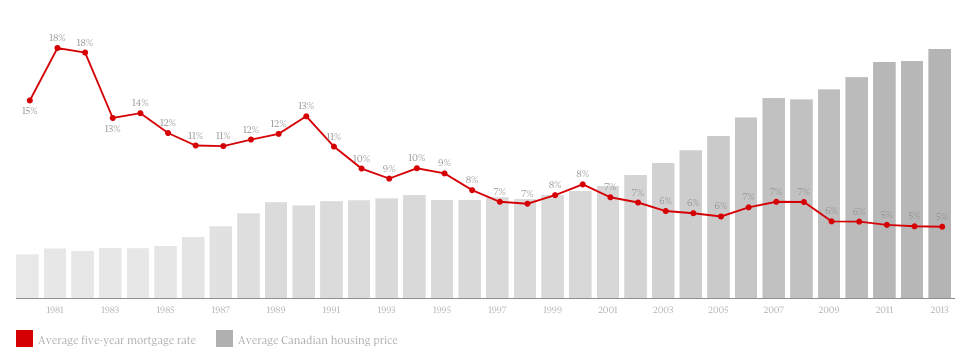

# More Interest, Lower House Price? 

#### Keywords {-}

real estate, interest, house price, behavioral psychology, the housing bubble

## The Puzzle

It’s true that the cost of borrowing becomes more expensive, the availability of capital is shrunk and the demand for investment is also affected when interest rates increase. 

However, over the past thirty years, increases in Canadian mortgage rates have not tended to trigger a decrease in houses prices. In fact, more often than not the reverse is true. the average five-year residential mortgage lending rate (from Statistics Canada) and compared it to the average selling price of a Canadian home (provided in a report by the Canadian Real Estate Association), on a month-by-month basis from January 1980, up to June 2010. Over this period, totaling 365 months, there were 156 instances where the five-year residential mortgage rate increased over the prior month, and in 97 of these cases, house prices increased two months later. 

see the chart of interest rate/avg house price between 1980 - 2010: 
```{r rateprice,echo=FALSE,fig.cap='rateprice',fig.align='center',out.width='80%'}

```

The puzzles I want to solve here by behavior psychology can be quantified by the following survey question ideas: 
1. How much increase or decrease of the interest rate will trigger the different investment desire from people who want to buy or sell the house? 
2. Is there a satisfaction point to trigger people to make the profit by selling the house? for example, if the net profit value is over 10%,  the owner is likely to sell the house for quick money. 
3. Is there a stop-loss point that people will not buy the house due to high-interest cost? even when the interest rate goes higher, but it may still be within people's patience for the investment desire. For example, the rental income can cover the HOA or interest payment, but not covering the principle of the mortgage in San Fransico, people will still buy the apartment as they believe the future increased value will eventually pay off the cost and they can at least make X% profit. 

## My Thoughts

Although the profit is the math problem, it is the satisfaction expectation of the future profit or loss to trigger people's movement. 

I want to introduce the behavioral psychology in the study. 

One of the applications of the behavioral psychology here, 
1) in general, people may become insensitive to the changes when time goes. 
In another word, the memory and forgetting may be one of the numerous factors of the endurance of higher house price during the interest rate change process. 
2) in general, people are short-sighted. 
In this case, it may well present how people make the decision based on the estimate of the future. 

The study will help to explain why there is still irrational behavior during the housing boom with a going-up interest rate. 

## My Goal

For the housing industry heavily weighted cities like Vancouver, the increase or the decrease of the interest rate may or may not be the only key influencer of the house price.

I want to use the analysis to give a high-level opinion to the local government: 

If the difference of (the assessment value of the house - purchased price) is accelerating to a certain level, the government shall expect how much more people will decide to sell for profit,  and how much more and more people will take the credit risk to buy the apartment for future profit even though interest rate is going up based on my sampling survey data. 

To influence people's decision not to jump into a heated house market, there might be some new way other than the interest rate.

A rough guess on the new way:
- a sad story for a bank broken person who bet on the housing boom in the media?  
