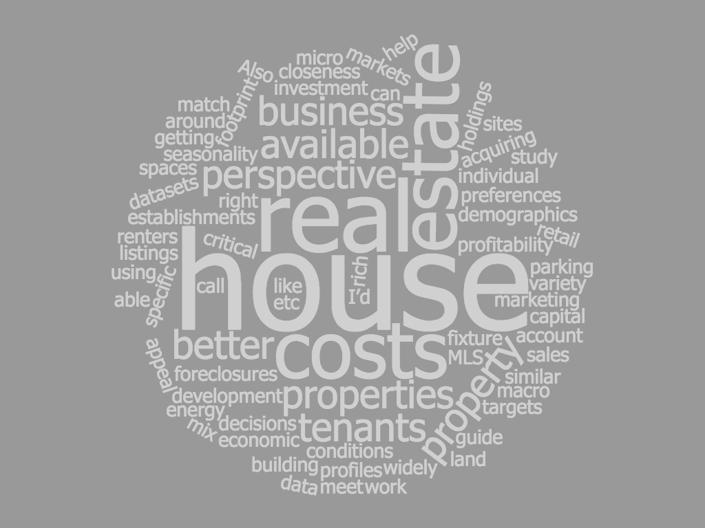

<!-- This won't be displayed but it will initialize your R session. Add any R libraries you need here. -->
```{r init,include=FALSE,echo=FALSE}
library(magrittr)
#library("htmltools")
#library("vembedr")
```


# RDATA Projects {-}

<!-- You can include images saved within your repo... -->
```{r realestate,echo=FALSE,fig.cap='realestate',fig.align='center',out.width='100%'}

```

### The Desicion Model of Real Estate Buyers and Sellers {-}

The real estate model shall reveal of the correlationship between the housing demand with the population profile, city development plan, location, and policy change factors (or even with interest rate, economic environment)will help people to think more comprehensively towards housing market.And I hope the model I build will help the buyer or seller find a better timing for the transaction.

### More Interest, Lower House Price? {-}

The puzzles I want to solve here by behavior psychology can be quantified by the following survey question ideas: 
1. How much increase or decrease of the interest rate will trigger the different investment desire from people who want to buy or sell the house? 
2. Is there a satisfaction point to trigger people to make the profit by selling the house? for example, if the net profit value is over 10%,  the owner is likely to sell the house for quick money. 
3. Is there a stop-loss point that people will not buy the house due to high-interest cost? even when the interest rate goes higher, but it may still be within people's patience for the investment desire. For example, the rental income can cover the HOA or interest payment, but not covering the principle of the mortgage in San Fransico, people will still buy the apartment as they believe the future increased value will eventually pay off the cost and they can at least make X% profit. 
  
## About Li {-}

Li is studying master’s of information and data science @ UC Berkeley School of Information.

She has great interests in the real estate market analysis. She believes that using data science tools can leverage the rich datasets available around urban planning, renters demographics, preferences, seasonality, economic conditions in specific markets to better guide capital decisions on acquiring property. She is looking for a better modeling which is not only taking macro business perspectives like "interest rate, land costs, development costs, fixture costs & any other sales and marketing costs to appeal to tenants into account and the micro business perspectives like MLS listings for similar properties, foreclosures, closeness to retail establishments, work sites, building profiles, parking spaces, energy footprint etc, but also the developing perspectives like the urban planning, economic geography, behavior psychology. 


```{r intro,echo=FALSE}
knitr::include_url("https://www.youtube.com/embed/HMBnB1Ot1Ys?rel=0&modestbranding=1", height = "400px")
```

*Updated: `r Sys.Date()`*
